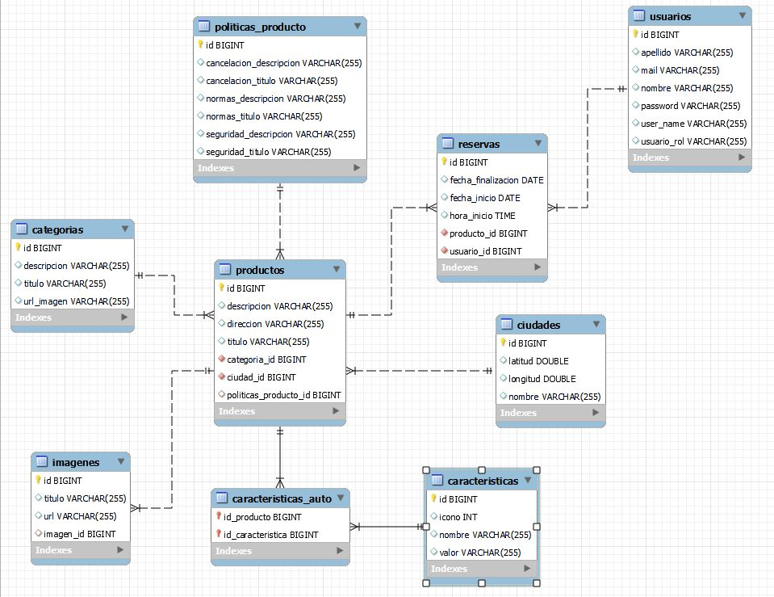
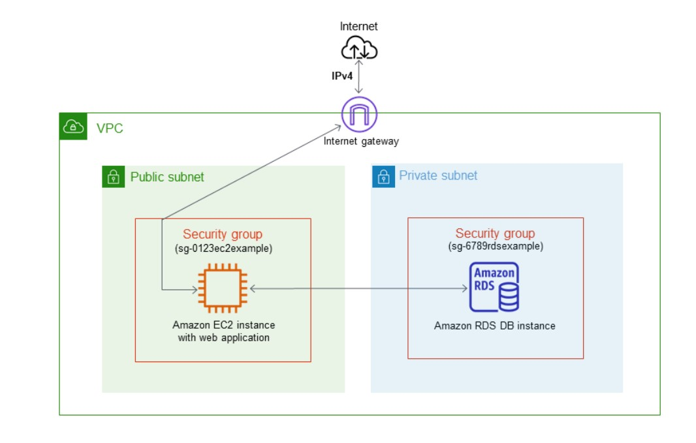

# Revolt's Rentals

Una aplicación web para el alquiler temporario de automóviles, desarrollada por el equipo 5 (Backend Boys), como proyecto final del primer track de la carrera Certified Tech Developer, desarrollada por Digital House, en colaboración con Mercado Libre y Globant.

## Autores

- Nicolas Montero (https://www.github.com/nicomontero) Fortalezas: Back-End y Base de Datos . Intermedio: Infraestructura y Testing. Debiliadades: Front-End

- Serafín Quesada (https://www.github.com/seraquesada) Fortalezas: Front-End. Intermedio: Testing y Base de Datos. Debiliadades: Back-End e Infraestructura

- Luca Beati (https://github.com/LukaBrc) Fortalezas: Back-End e Infraestructura. Intermedio: Base de Datos, Testing. Debilidades: Front-End.

- Joaquín Aldana (https://www.github.com/joacoaldana) Fortalezas: Front End.
Intermedio: Back-End y Base de Datos. Debilidades: Testing e Infraestructura

- Joaquín Sarmiento (https://www.github.com/joasarmiento) Fortalezas: Infraestructura y Base de Datos. Intermedio: Back-End. Debilidades: Testing y Front-End

- Esteban Casares (https://www.gitlab.com/esteban.casares) Fortalezas: Testing. Intermedio: Front-End y Base de Datos. Debilidades: Back-End e Infraestructura.

## Bitacora del Proyecto

### Primer Sprint

Quizás el sprint que más dudas teníamos al respecto, ya que no sabíamos bien por donde encararlo, que hacer primero o como organizarnos en general, nos costó unos días empezar a sentirnos cómodos con esta forma de trabajar, pero pudimos arrancar y lograr todas las issues presentadas.

### Segundo Sprint

Sin dudas el mejor sprint del equipo, pudimos corregir erros del primero y cumplir con todas las issues presentadas. Entendimos mejor el trabajo en equipo y la división de responsabilidades. 

### Tercer Sprint 

En este sprint tuvimos varios contratiempos, con la enfermedad de un compañero y la perdida de la computadora de otro, por lo cual no pudimos llegar a la retro de manera satisfactoria, ya que tuvimos que poner prioridad a las issues más necesarias.

### Cuarto Sprint

Sabiendo nuestras issues incompletas del tercer sprint, tuvimos que ser muy productivos y participativos para lograr llegar a la entrega final bien y lo fuimos, logramos completar la issues anteriores y las del mismo sprint, lo que nos dejó muy satisfechos con el producto final, igualmente entendemos las ciertas carencias que tiene proyecto, principalmente debido a que fue nuestro primer proyecto.

## Herramientas Utilizadas

### Front end
- React + Vite Js
- Node + NPM

### Back end
- Java
- Spring
- Hibernate
- API Rest
- JSON
- JWT
- Spring Security

### Base de datos
- AWS RDS: MySQL
- MySQL Workbench

### Testing
- Postman
- Selenium

### Infraestructura
- AWS: RDS
- AWS: EC2
- AWS: S3 Buckets
- GitLab: Pipelines

### Gestion
- Git + Gitlab
- Discord
- Zoom
- Calendly
- Trello

## Documentación técnica del proyecto

### Ambiente de Desarrollo

- Crear una rama por cada feature que va a estar desarrollando y llamándola según esa feature.
— Solamente mergear a la rama dev cuando esté testeada y 100% funcional.
- Comprobar que el deployment haya tomado todos los cambios. 
- Mantener el orden de carpetas dentro del proyecto y si es necesario agregar los archivos al gitignore, pero no sacar nada sin preguntar.
- Siempre optar por un desarrollo donde la aplicación puede ser escalable a largo plazo

### Base de Datos

En la siguiente foto vamos a mostrar como quedo la base de datos final

### Infraestructura y Deployment

La aplicación web se encuentra desplegada y completamente funcional en AWS. Se puede acceder a través del siguiente link:

- http://grupo5front.s3-website.us-east-2.amazonaws.com/

### Testing y calidad

En cada Sprint:

- Back-End : realizamos testeos sobre los Controller y Service desarrollados.

- Postman : Generamos y corremos los scripts para testear los endpoints creados.

- Generamos casos de prueba (positivos y negativos) en base a las historias de usuarios.

- Generamos un ciclo de testeos con nuevas pruebas (Smoke), la repetición de las pruebas fallidas anteriormente (regresión) y/o la repetición de pruebas por modificaciones de funcionalidades (regresión). 

- Corremos el ciclo, se reflejan los resultados

- Creamos y corremos en Selenium pruebas sobre los desarrollos del sprint.

- Se retroalimenta al equipo de desarrollo.

Se hicieron Smoke Test, Pruebas Exploratorias, Pruebas Unitarias, Test con Selenium y Postman

### Paginas
    Página de inicio:

    - Incluye formulario de login y registro.
    - Contiene barra de búsqueda, donde se pueda seleccionar la fecha, lugar, además de un filtro por categorías.
    - Incluye una lista de productos de ejemplo. 
    - Incluye pie de página con el logo, año, copyright y redes sociales. 

    Página de detalle del producto:
    - Se exhibe el detalle del producto seleccionado.
    - Contiene título, fotos, descripción, categoría, atributos, disponibilidad y valor del producto. 
    - Contiene botón para ir a la página de reservas y otro para volver a la home. 
    - Se agregan a la API los endpoints de ciudades y productos.

    Página de reserva y de pedido:

    - Contiene información sobre la disponibilidad del producto, el cliente y la reserva.

## Muchas Gracias Por Leer.

